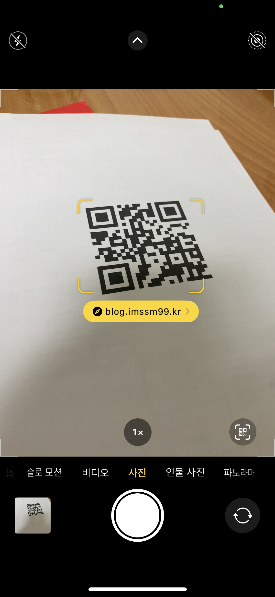
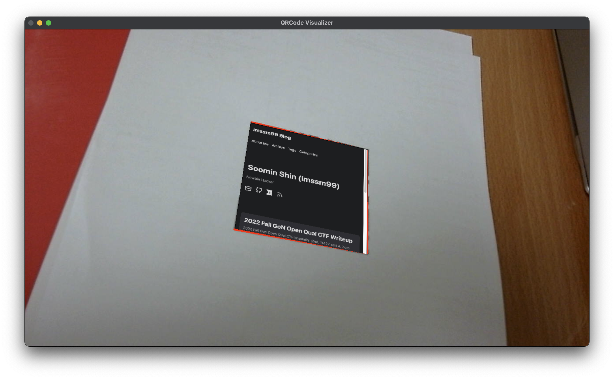
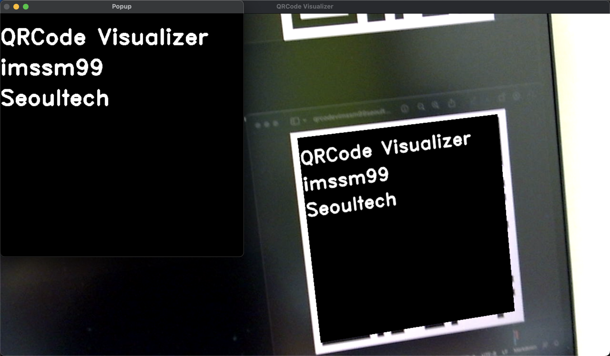

# QRCode Visualizer

## About Project

Most QR code reader programs are designed to display the address when a URL is detected in the QR Code data and open web browser when clicked.

This has a problem that it is difficult to represent the actual information of the QR Code.

In this project, we aim to express QR Code in real-time to make the information more accessible to users.

iPhone Camera | QRCode Visualizer
:---:|:---:
 | 

## Contents

- calibration_result.npz: Sample calibration result of Logitech C270 
- camera_calibration.py: Source code for calibrating camera
- LICENSE.txt: License of the project
- qrcode_visualizer.py: Main source code of the project
- README.md: Description of the project
- requirements.txt: List of the python library that requires to run program

- assets: Images in readme file
- qrcode_samples: Sample QR Codes
    - webpage.png: My blog url
    - box.png, bunny.png: 3D object url that ends with `.xyz` (May not work when my web server down)
    - paint_1.png, paint_2.png: Text starts with `QRV_PAINT`
    - text.png, text_multiline.png: Just text which not matches any conditions 

## Getting Started

### Prerequisites

```
pip3 install -r requirements.txt
```

### Run

```
python3 qrcode_visualizer.py
```

- Calibrate camera if no `calibration_result.npz` exists
- Existing `calibration_result.npz` is calibration data of Logitech C270
- You need 10x7 25mm checkerboard
- It calibrates automatically when chessboard recognized
- `esc`: end calibration
- Visualize qrcode!

## Features

### Web Page

https://github.com/imssm99/qrcode-visualizer/assets/15193055/5ffde759-1218-4180-8cad-4fa78d7436b6

You can click rendered web page area to open page in web browser

### 3D Object

https://github.com/imssm99/qrcode-visualizer/assets/15193055/82122f7e-2bb5-4870-b35e-c42b189e5c5b

### Memo

https://github.com/imssm99/qrcode-visualizer/assets/15193055/bea05b4b-0d74-4f36-a61e-96b5cd01a354

You can click to draw something on memo qr code

### Text

https://github.com/imssm99/qrcode-visualizer/assets/15193055/a3d96be8-a403-4e2a-ae2e-75c5820813aa


You can click rendered text area to open popup

## How this works

### QR Code

- QR Code is 2-dimensional black-white pattern which contains information. It is widely used in representing url, payments, ticket data.
- OpenCV has feature that can recognize and decode QR Code. 

### Image Formation

- From camera calibration, we can get camera matrix `K` and distortion coefficient
- So we can calculate camera pose and project points
- Render object on projected points
- Perspective transform makes image warp to projected points
- In memo feature, we can get mouse point coordinate from inversing transform matrix

## Future Enhancements

- Performance of detecting and decoding QR Code is not very good
- I tried OpenCV and ZBar, both of them not works perfectly
- This project can add more features from various type of QR Code information

## License

Distributed under the MIT License. See `LICENSE.txt` for more information.

## Dependencies

- Written in [Python3](https://www.python.org)
- [OpenCV](https://opencv.org) for capture and process video
- [Selenium](https://www.selenium.dev) for render web page

## References

- [mint-lab/cv_tutorial](https://github.com/mint-lab/cv_tutorial)
